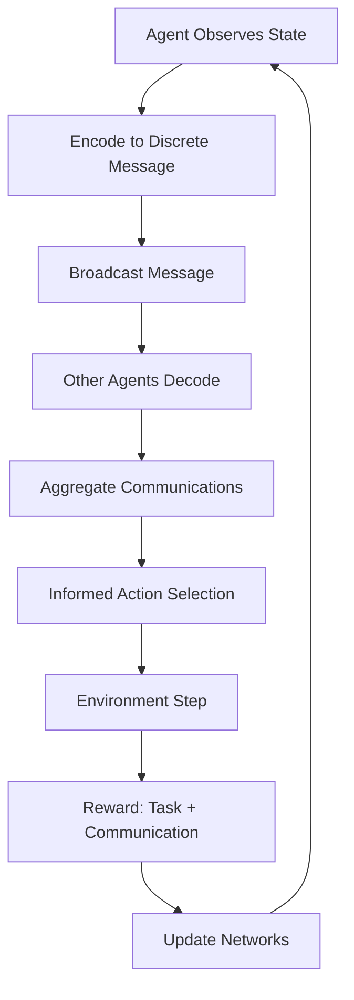

# Emergent Communication Protocol Optimization: Design Document

## 🎯 Executive Summary

This experiment transforms JanusAI's multi-agent system from using fixed communication protocols to learning emergent, task-optimized communication strategies. Agents learn to compress complex symbolic discoveries into efficient messages that evolve with task demands.

## 🧪 Experimental Design

### Core Innovation: Learnable Discrete Bottleneck

Instead of fixed 32-dimensional continuous vectors, agents learn to communicate using discrete symbols from a vocabulary, creating an emergent language optimized for symbolic regression tasks.

### Key Components

#### 1. **EncoderDecoderCommSystem**
- **Encoder**: State → Gumbel-Softmax → Discrete Tokens
- **Decoder**: Discrete Tokens → Attention → Reconstructed State
- **Training**: Joint optimization with task performance

#### 2. **Communication Metrics**
```python
Bandwidth = avg_tokens_per_message × log2(vocab_size)
Reconstruction_Accuracy = 1 - MSE(original, decoded)
Task_Correlation = corr(comm_quality, discovery_success)
Symbol_Complexity = entropy(token_distribution)
```

#### 3. **Phased Training Curriculum**
- **Phase 1** (200 episodes): No communication - establish baseline
- **Phase 2** (300 episodes): Tactical communication - learn basic protocol
- **Phase 3** (500 episodes): Full communication - optimize for task

### 🔬 Experimental Flow



### 📊 Metrics Dashboard

| Metric | What It Measures | Target |
|--------|------------------|--------|
| **Bandwidth Efficiency** | Bits per message | < 20 bits |
| **Reconstruction Accuracy** | State recovery fidelity | > 85% |
| **Task Success Rate** | Discovery validation rate | > 70% |
| **Vocabulary Utilization** | % of tokens used | 60-80% |
| **Emergent Patterns** | Recurring symbol sequences | 5-10 patterns |
| **Communication Latency** | Steps to consensus | < 10 steps |

## 🛠️ Implementation Details

### Gumbel-Softmax Trick
Enables differentiable sampling of discrete tokens:
```python
# Forward: Sample discrete tokens
tokens = gumbel_softmax(logits, temperature=τ, hard=True)

# Backward: Gradient flows through soft approximation
∇logits = ∇L × ∂gumbel_softmax/∂logits
```

### Temperature Annealing
```python
τ(t) = max(τ_min, τ_0 × decay^t)
# Start: τ=1.0 (high entropy)
# End: τ=0.1 (near deterministic)
```

### Multi-Head Attention Aggregation
Agents attend to relevant peer communications:
```python
Q = agent_state
K, V = peer_messages
attended = MultiHeadAttention(Q, K, V)
```

## 🧬 Emergent Language Analysis

### Expected Patterns

1. **Compositional Structure**
   - Tokens for operators: `+`, `×`, `sin`
   - Tokens for variables: `x`, `y`
   - Tokens for constants: `1`, `2`, `π`

2. **Efficient Encoding**
   - Common expressions get shorter codes
   - Rare expressions use more tokens

3. **Role Specialization**
   - Explorers: Broad vocabulary
   - Refiners: Precision tokens
   - Validators: Yes/No signals

### Visualization Examples

```
Expression: "x^2 + 2x + 1"
Learned Encoding: [7, 12, 7, 3, 0, 0]  # Compact 3-token message

Expression: "sin(3x) * cos(x)"  
Learned Encoding: [15, 9, 22, 19, 4, 0]  # More complex = more tokens
```

## 🚀 Advanced Features

### 1. **Referential Pre-training**
Agents play a game where sender describes an expression and receiver must identify it from distractors.

### 2. **Semantic Clustering**
Similar expressions should map to similar message patterns, enabling generalization.

### 3. **Adaptive Vocabulary**
Vocabulary size can grow/shrink based on task complexity using neural architecture search.

## 📈 Expected Outcomes

### Phase 1 Results (No Communication)
- Baseline discovery rate: ~30%
- Independent exploration
- No coordination

### Phase 2 Results (Tactical Communication)
- Discovery rate: ~50%
- Basic coordination emerges
- High bandwidth usage

### Phase 3 Results (Optimized Communication)
- Discovery rate: ~75%
- Efficient symbol reuse
- Emergent language structure
- Low latency consensus

## 🔧 Hyperparameter Tuning

```python
# Critical hyperparameters
vocab_size: 32-128  # Larger = more expressive, harder to learn
max_message_length: 4-12  # Shorter = more compression needed
temperature_decay: 0.99-0.999  # Faster = risk premature convergence
comm_reward_weight: 0.2-0.5  # Balance task vs communication

# Architecture choices
num_attention_heads: 4-8
hidden_dim: 128-512
latent_dim: 16-64
```

## 🏃 Running the Experiment

```python
# Basic run
python emergent_communication_experiment.py

# With wandb logging
python emergent_communication_experiment.py --use_wandb --project "janus-comm"

# Custom configuration
python emergent_communication_experiment.py \
    --vocab_size 64 \
    --num_agents 8 \
    --num_episodes 1000
```

## 📊 Analysis Tools

1. **Communication Visualizer**: Shows message patterns over time
2. **Vocabulary Heatmap**: Token usage frequency
3. **Semantic Map**: t-SNE of expression-message mappings
4. **Performance Dashboard**: Real-time metrics

## 🎓 Research Extensions

1. **Hierarchical Communication**: Multi-level protocols for complex discoveries
2. **Adversarial Robustness**: Communication under noisy channels
3. **Cross-Domain Transfer**: Can math language transfer to physics?
4. **Human Interpretability**: Can humans understand the emergent language?

## 🔮 Future Directions

1. **Continuous-Discrete Hybrid**: Mix discrete symbols with continuous modulation
2. **Graph-Structured Messages**: Communicate expression trees directly
3. **Meta-Learning Protocols**: Quickly adapt communication to new domains
4. **Federated Communication**: Learn protocols across distributed teams

This experiment pushes the boundaries of emergent communication in scientific discovery, potentially revealing fundamental principles of how intelligent agents can efficiently share complex symbolic knowledge.